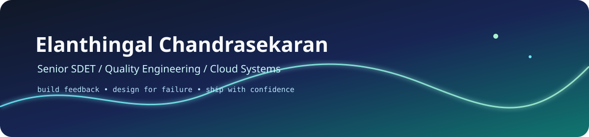

  
  

    <a href="https://elanthingal.github.io/"><strong>Open portfolio site &nearr;</strong></a>
    &nbsp;&middot;&nbsp;
    <a href="experience.md">Experience</a> ·
    <a href="projects.md">Projects</a> ·
    <a href="ai.md">AI systems</a> ·
    <a href="aws.md">AWS work</a> ·
    <a href="content.md">Content</a> ·
    <a href="contact.md">Contact</a>
  

  

    
    
    
    
    
  

<h2 align="center">Engineering systems that are easier to trust.</h2>

  I am a Senior SDET building quality platforms, cloud automation, and
   
  measurable AI workflows that turn complex failure into useful feedback.

  <a href="https://www.linkedin.com/in/elanthingal-chandrasekaran/"><strong>Work with me</strong></a>
  &nbsp;&nbsp;&nbsp;
  <a href="projects.md"><strong>See the systems</strong></a>

 

<table>
  <tr>
    <td align="center" width="25%">
      <strong>01</strong> 
      QUALITY 
      Test strategy and release confidence
    </td>
    <td align="center" width="25%">
      <strong>02</strong> 
      CLOUD 
      Event-driven AWS systems
    </td>
    <td align="center" width="25%">
      <strong>03</strong> 
      AI SYSTEMS 
      Agents with bounded behavior
    </td>
    <td align="center" width="25%">
      <strong>04</strong> 
      OPERATIONS 
      Observable paths and safe recovery
    </td>
  </tr>
</table>

## The Workbench

<table>
  <tr>
    <td width="52%" valign="top">
      <h3>What I am building</h3>
      

        Practical engineering tools that make feedback faster, failures
        clearer, and delivery safer.
      

      

        <strong>Now:</strong> deterministic benchmarks for AI agents,
        quality gates for generated code, and self-hosted automation with
        explicit operator controls.
      

      

        <a href="ai.md">Open the AI systems page &rarr;</a>
      

    </td>
    <td width="48%" valign="top">
      <h3>How I work</h3>
      

        <code>Understand</code> &rarr; <code>Design</code> &rarr;
        <code>Validate</code> &rarr; <code>Operate</code>
      

      

        I care about the path after the happy path: timeouts, permissions,
        retries, diagnostics, rollback, and the next action after failure.
      

      

        <a href="experience.md">Read my engineering principles &rarr;</a>
      

    </td>
  </tr>
</table>

## Featured Systems

<table>
  <tr>
    <td width="33%" valign="top">
      <h3><a href="ai.md">AI agents</a></h3>
      
Skills, SOPs, scoped tools, runtime boundaries, and evidence-based evaluation.

      AGENT DESIGN / BENCHMARKS / QUALITY GATES
    </td>
    <td width="33%" valign="top">
      <h3><a href="aws.md">Cloud systems</a></h3>
      
Infrastructure and event-driven workloads designed for clear ownership and safe delivery.

      AWS CDK / LAMBDA / SNS / IAM
    </td>
    <td width="33%" valign="top">
      <h3><a href="projects.md">Quality platforms</a></h3>
      
Automation and diagnostics that shorten the distance between failure and fix.

      API / UI / MOBILE / DEVTOOLS
    </td>
  </tr>
</table>

## Toolbox

  
  
  
  
  
  
  
  
  

  
<strong>More technologies</strong>

  C++ / Bash / AWS CDK / Lambda / SNS / VPC / IAM / Next.js /
  Django / Flask / Flutter / Firebase

  <strong>Build feedback. Design for failure. Ship with confidence.</strong>
   
  Thanks for stopping by. Follow along or reach out if you are building something difficult.

