

  
  

    
  

  

    
    
    
    
    
    
  

  

    
    
    
    
    
  

  
  

  <a href="https://www.linkedin.com/in/elanthingal-chandrasekaran/">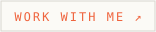</a>
  &nbsp;
  

 

  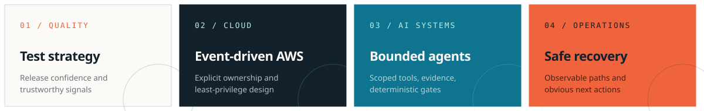

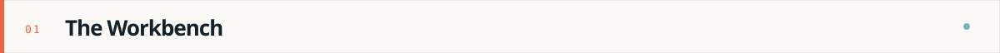

  <a href="ai.md">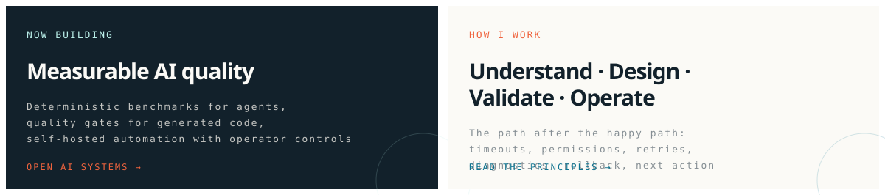</a>

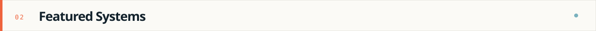

<table>
  <tr>
    <td width="33%"><a href="ai.md">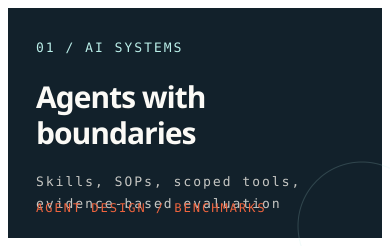</a></td>
    <td width="33%"><a href="aws.md">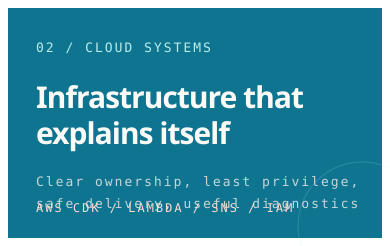</a></td>
    <td width="33%"><a href="projects.md">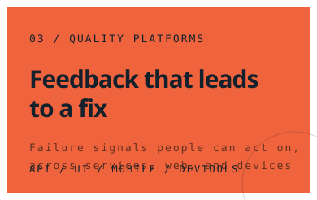</a></td>
  </tr>
</table>

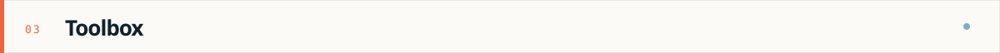

  
  
  
  
  
  
  
  
  

  
  
  
  
  
  
  
  
  
  
  
  

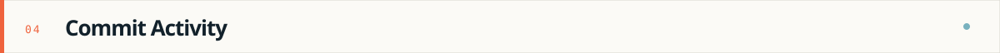

  <a href="https://github.com/Elanthingal">
    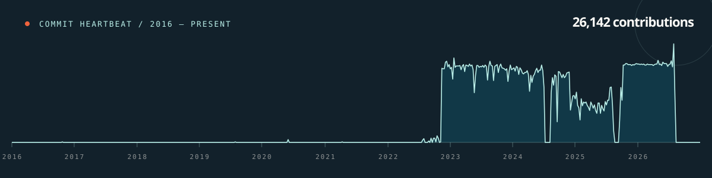
  </a>

  

 

