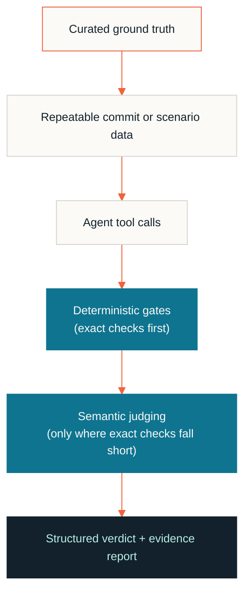

  
  
  
  
  
  
  

  
  
  

I build agents for engineering workflows where the output must be useful,
reviewable, and safe to operate.

Typical capabilities include:

- Test authoring and scenario generation
- Python-to-TypeScript test migration
- Test validation and stabilization
- Runtime investigation through scoped tools
- Skill and SOP loading based on the task
- Structured summaries of work performed and remaining gaps

The design goal is a bounded engineering system, not an unconstrained chatbot.
Tools, context, permissions, and completion criteria should all be explicit.

The systems are organized as a pipeline rather than a single model call:

| Layer | Responsibility |
| --- | --- |
| Task contract | Define the scenario, inputs, expected artifacts, and failure conditions |
| Agent runtime | Load the relevant skills and SOPs, then use only scoped tools |
| Execution boundary | Separate authoring, validation, and optional runtime execution |
| Evaluation gates | Apply deterministic checks before semantic judging |
| Evidence flow | Persist artifacts, verdicts, diagnostics, and upload metadata |

This separation makes it possible to distinguish an agent defect from a tool,
infrastructure, or environment failure.

Agent quality needs a repeatable measurement layer. My benchmark approach uses:

Evaluation can classify outcomes as:

| Verdict | Meaning |
| --- | --- |
| Match | The agent identifies the key expected result |
| Partial match | The agent identifies part of the expected result |
| Miss | The agent fails to identify the important result |
| Error | The evaluation could not complete reliably |

The benchmark work includes reusable patterns for:

- Category-specific suites so discovery, development, testing, and pipeline
  behavior can be measured independently.
- Hybrid gate evaluators that combine exact checks with semantic comparison
  only when needed.
- Migration-fidelity gates that verify generated tests preserve the intent of
  the source behavior.
- Context-budget gates that prevent always-loaded instructions from growing
  without control.
- Stage-aware artifact and result uploads so outputs remain traceable across
  environments.
- Opt-in runtime execution so authoring-only workflows do not acquire
  unnecessary side effects.

- Keep scenario inputs and expected outcomes versioned.
- Use deterministic string or rule checks for safety-critical conditions.
- Use semantic judging only where exact matching is insufficient.
- Record evidence, not just a score.
- Separate agent quality from infrastructure or tool failures.
- Re-run misses and partial matches through a diagnosis workflow.

The goal is not to make an agent appear intelligent. The goal is to know when
it is correct, when it is uncertain, and when it should not be trusted.

---

  
  &nbsp;
  

