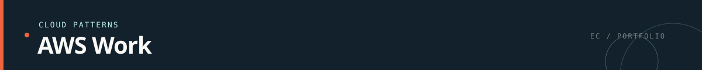
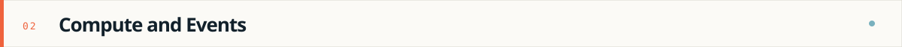
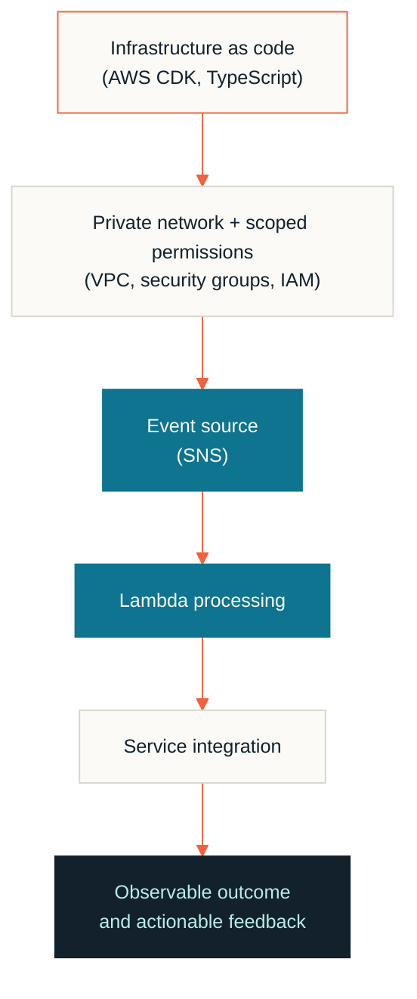

  
  
  
  
  
  
  

  
  
  
  
  

My AWS experience is centered on building cloud systems that are repeatable,
secure, and diagnosable rather than treating infrastructure as a collection
of manual console settings.

- AWS CDK stacks written in TypeScript
- Environment-aware configuration and resource naming
- Repeatable deployment patterns
- Explicit network and security boundaries

- AWS Lambda workloads for analysis and processing
- SNS topics and Lambda subscriptions for event-driven flows
- Runtime configuration, memory, timeout, and execution behavior
- API integrations between internal services

- VPC-connected workloads
- Private service endpoints
- Security groups and controlled network access
- IAM policies scoped to required actions
- Operational access designed around explicit permissions

- Prefer infrastructure that can be reviewed as code.
- Make resource dependencies and permissions visible.
- Design for failure, retries, timeouts, and useful logs.
- Separate environment configuration from application behavior.
- Keep proprietary service names and implementation details private.

---

  
  &nbsp;
  

