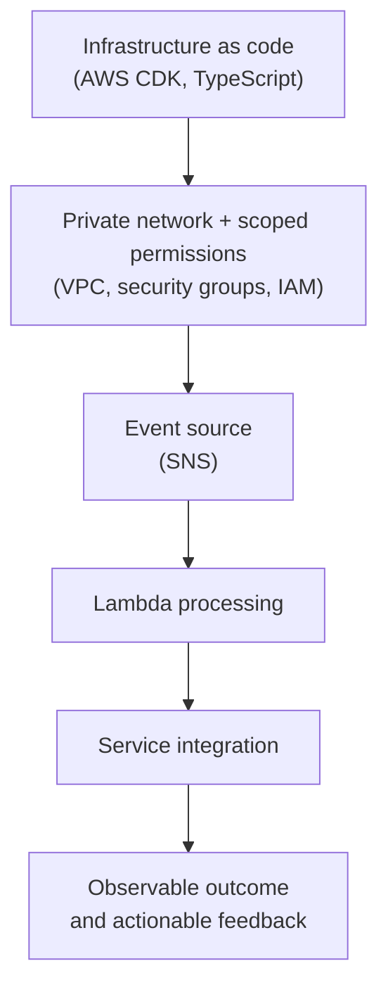

  <a href="README.md">Home</a> ·
  <a href="experience.md">Experience</a> ·
  <a href="projects.md">Projects</a> ·
  <a href="ai.md">AI systems</a> ·
  <a href="aws.md">AWS work</a> ·
  <a href="content.md">Content</a> ·
  <a href="contact.md">Contact</a>

# AWS Work

  
  
  
  
  

My AWS experience is centered on building cloud systems that are repeatable,
secure, and diagnosable rather than treating infrastructure as a collection
of manual console settings.

## Infrastructure as Code

- AWS CDK stacks written in TypeScript
- Environment-aware configuration and resource naming
- Repeatable deployment patterns
- Explicit network and security boundaries

## Compute and Events

- AWS Lambda workloads for analysis and processing
- SNS topics and Lambda subscriptions for event-driven flows
- Runtime configuration, memory, timeout, and execution behavior
- API integrations between internal services

## Networking and Security

- VPC-connected workloads
- Private service endpoints
- Security groups and controlled network access
- IAM policies scoped to required actions
- Operational access designed around explicit permissions

## Engineering Approach

- Prefer infrastructure that can be reviewed as code.
- Make resource dependencies and permissions visible.
- Design for failure, retries, timeouts, and useful logs.
- Separate environment configuration from application behavior.
- Keep proprietary service names and implementation details private.

## Architecture Shape

---

  <a href="README.md">← Back to home</a>
  &nbsp;·&nbsp;
  <a href="https://www.linkedin.com/in/elanthingal-chandrasekaran/">Connect on LinkedIn</a>

