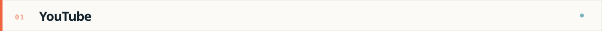
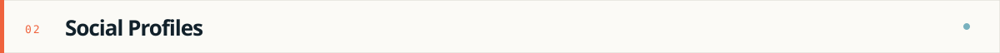
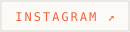

  
  
  
  
  
  
  

  

I use public channels to share engineering interests, projects, and ideas.

  
  
  
  

This page will grow as new demos, technical notes, talks, and project
walkthroughs are published — short workflow demos, architecture walkthroughs,
and debugging notes that turn real failures into reusable lessons.

---

  
  &nbsp;
  

