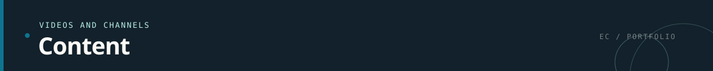

  <a href="README.md">Home</a> ·
  <a href="experience.md">Experience</a> ·
  <a href="projects.md">Projects</a> ·
  <a href="ai.md">AI systems</a> ·
  <a href="aws.md">AWS work</a> ·
  <a href="content.md">Content</a> ·
  <a href="contact.md">Contact</a>

  

I use public channels to share engineering interests, projects, and ideas.

## YouTube

[Visit my YouTube channel](https://www.youtube.com/@elanthingalc)

## Social Profiles

- [LinkedIn](https://www.linkedin.com/in/elanthingal-chandrasekaran/)
- [X](https://x.com/elanthingal)
- [Instagram](https://www.instagram.com/elanthingal)
- [GitHub](https://github.com/Elanthingal)

This page will grow as new demos, technical notes, talks, and project
walkthroughs are published — short workflow demos, architecture walkthroughs,
and debugging notes that turn real failures into reusable lessons.

---

  <a href="README.md">← Back to home</a>
  &nbsp;·&nbsp;
  <a href="https://www.linkedin.com/in/elanthingal-chandrasekaran/">Connect on LinkedIn</a>

